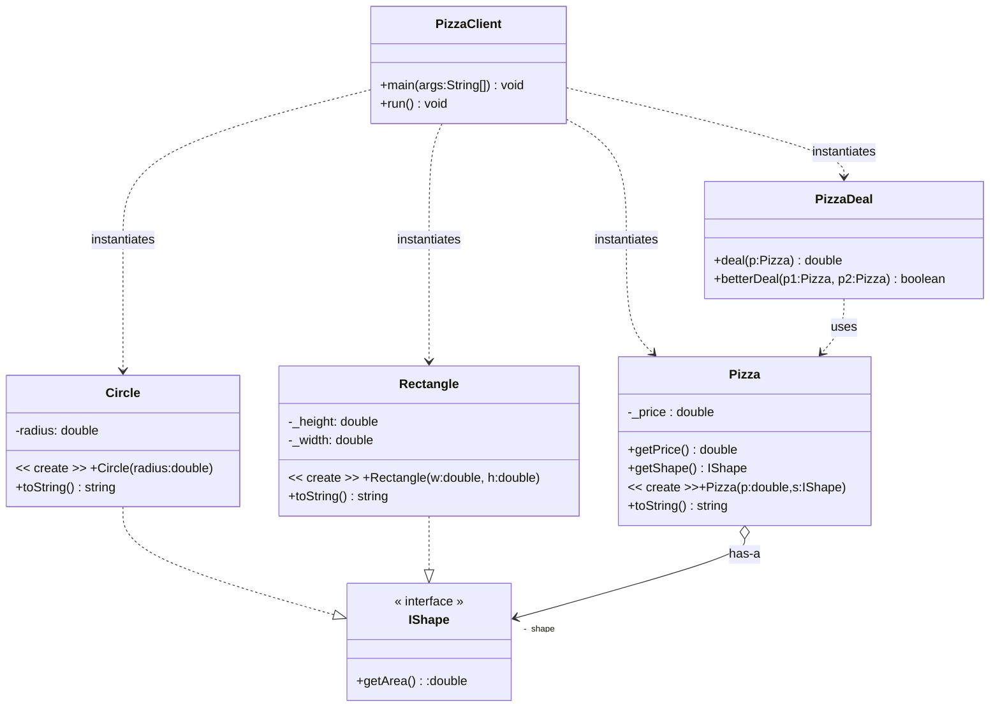

pizza-class-diagram.md

```mermaid

classDiagram

    class Pizza{
        -_price : double
        +getPrice()double
        +getShape()IShape
        << create >>+Pizza(p:double,s:IShape)
        +toString()string
    }

    class IShape{
        << interface >>
        +getArea():double
    }

    class Circle{
        -radius: double
        << create >> +Circle(radius:double)
        +toString()string
    }

    class Rectangle{
        -_height: double
        -_width: double
        << create >> +Rectangle(w:double, h:double)
        +toString()string
    }

    class PizzaClient{
        +main(args:String[])void
        +run()void
    }

    class PizzaDeal{
        +deal(p:Pizza)double
        +betterDeal(p1:Pizza, p2:Pizza)boolean
    }

    Circle ..|> IShape
    Rectangle ..|> IShape
    PizzaClient ..> Pizza:instantiates
    PizzaClient ..> PizzaDeal:instantiates
    PizzaClient ..> Circle:instantiates
    PizzaClient ..> Rectangle:instantiates
    PizzaDeal ..> Pizza:uses
    Pizza o--> "-_shape" IShape:has-a


```