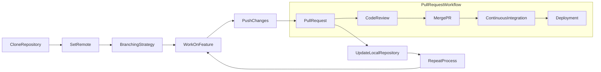

# Tic-Tac-Toe Game

This is a simple command-line implementation of the Tic-Tac-Toe game written in Python.

## Table of Contents

- [Overview](#overview)
- [Usage](#usage)
- [Documentation](#documentation)
- [Contributing](#contributing)
- [License](#license)

## Overview

This program allows two players to play Tic-Tac-Toe against each other on the command line. The game board is displayed after each move, and the players take turns entering their moves until one of them wins or the game ends in a draw.

## Usage

To play the game, simply run the `main.py` file using Python:

```bash
python main.py
```

Follow the prompts to enter row and column numbers to make your moves.

## Documentation

| Method                | Description                                     |
| --------------------- | ----------------------------------------------- |
| `print_board()`       | Prints the Tic-Tac-Toe board                    |
| `is_win(player)`      | Checks for a win condition for the given player |
| `tally_wins(results)` | Tally the number of wins from a list of results |
| `main()`              | Controls the Tic-Tac-Toe game                   |

[Documentation](https://robbozinoz.github.io/tic_tac_toe_docs/)

## Tasks

[] Implement basic game functionality
[] Add win condition checks
[] Handle invalid input gracefully
[] Implement AI for single-player mode (optional)

## Workflow Diagram



## Contributing

Contributions are welcome! If you'd like to contribute to this project, please follow these steps:

- Fork the repository
- Create a new branch (git checkout -b feature/new-feature)
- Make your changes
- Commit your changes (git commit -am 'Add new feature')
- Push to the branch (git push origin feature/new-feature)
- Create a new Pull Request